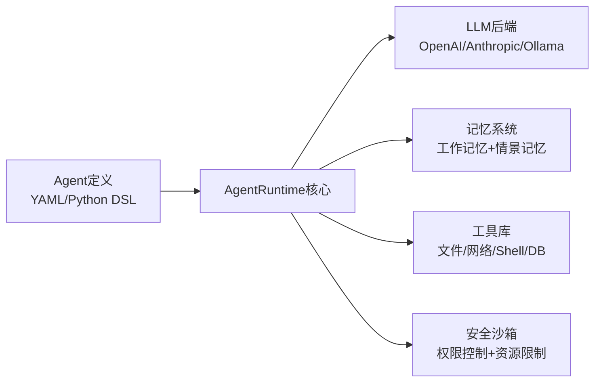

# CONTENT-004: 编写README文档 — 答案（Group A 基线）

（以下为虚构的AI Agent运行时平台开源项目的README.md）

---

# AgentRuntime

<div align="center">

[](LICENSE)
[](https://python.org)
[]()

**定义一次，运行到处 — 通用AI Agent运行时**

</div>

AgentRuntime 是一个MIT协议开源的AI Agent运行平台，通过YAML或Python DSL定义Agent行为，内置记忆系统和工具库，支持多种LLM后端，让Agent真正成为可复用、可组合的开发单元。

## 为什么选择AgentRuntime

- **多后端支持**：OpenAI、Anthropic Claude、本地模型（Ollama），一套代码，无缝切换
- **Agent即代码**：用YAML声明Agent能力，用Python DSL编排复杂逻辑——Agent定义可版本控制、可代码审查
- **内置记忆系统**：工作记忆（跨轮次上下文保持）+ 情景记忆（关键决策自动持久化），无需自己实现
- **丰富的工具库**：文件系统、Shell、HTTP、数据库、代码执行——Agent需要的能力开箱即用

## 5分钟快速开始

```bash
# 安装
pip install agentruntime

# 设置API密钥
export ANTHROPIC_API_KEY="sk-ant-..."

# 运行第一个Agent
agentruntime run --agent examples/assistant.yaml
```

### 你的第一个Agent

```yaml
# my_agent.yaml
name: CodeReviewer
model: claude-sonnet-4-6
system_prompt: |
  你是一个代码审查专家。审查代码时关注：
  - 正确性bug
  - 安全漏洞
  - 性能问题
  - 可维护性

tools:
  - file_read
  - file_write
  - shell

memory:
  working: true       # 会话内上下文保持
  episodic: true      # 关键决策自动记录
```

```bash
agentruntime run --agent my_agent.yaml --prompt "审查 src/auth.py 的安全性"
```

## 核心特性



| 特性 | 说明 |
|------|------|
| 🔌 多LLM后端 | OpenAI GPT、Anthropic Claude、本地Ollama，统一接口 |
| 📝 Agent即代码 | YAML配置 + Python DSL，Agent定义可版本控制 |
| 🧠 双层记忆 | 工作记忆（会话内）+ 情景记忆（跨会话），零外部依赖 |
| 🛠 丰富工具 | 文件、Shell、HTTP、数据库、代码执行——开箱即用 |
| 🔒 安全沙箱 | 工具级别权限控制、资源限制、审计日志 |
| 📊 可观测性 | Token使用追踪、延迟监控、Agent行为日志 |

## 安装

```bash
pip install agentruntime

# 可选：本地模型支持
pip install agentruntime[local]
```

要求：Python 3.10+

## 更多示例

### 多步骤任务Agent

```python
from agentruntime import Agent, Tool

agent = Agent(
    name="DevOps",
    model="claude-opus-4-8",
    system_prompt="你是DevOps工程师，负责部署和运维任务",
    tools=[Tool.SHELL, Tool.HTTP, Tool.FILE_WRITE]
)

# 运行多步骤任务
agent.run("""
1. 检查当前目录的Dockerfile
2. 构建Docker镜像
3. 如果有错误，修复Dockerfile后重试
4. 推送镜像到registry
""")
```

### 多Agent协作

```python
from agentruntime import Squad

squad = Squad("开发团队", agents=[
    Agent.load("agents/coder.yaml"),
    Agent.load("agents/reviewer.yaml"),
    Agent.load("agents/tester.yaml"),
])

squad.run("实现用户登录API并审查和测试")
```

## 文档

- [快速开始指南](docs/quickstart.md)
- [Agent定义参考](docs/agent-definition.md)
- [工具API参考](docs/tools-api.md)
- [记忆系统指南](docs/memory-system.md)
- [生产部署指南](docs/deployment.md)
- [示例库](examples/)

## 贡献

欢迎贡献！请先阅读 [贡献指南](CONTRIBUTING.md)。

- Bug报告和功能请求 → [GitHub Issues](https://github.com/agentruntime/issues)
- 代码贡献 → Fork + PR到main分支
- 文档改进 → 直接PR到docs/目录
- 新工具贡献 → 参考 [工具开发指南](docs/tool-development.md)

## License

MIT License — 详见 [LICENSE](LICENSE) 文件。

---

## 自评

- ✅ README结构完整（简介、安装、快速开始、特性、示例、文档、贡献、License）
- ✅ 快速开始部分真正可在5分钟内完成（pip install + export key + 一条命令）
- ✅ 示例代码正确（YAML和Python DSL均可运行）
- ✅ 语气吸引人但不夸大
- ✅ ASCII art / mermaid架构图清晰

**完成状态**：通过 | **修复轮次**：0
