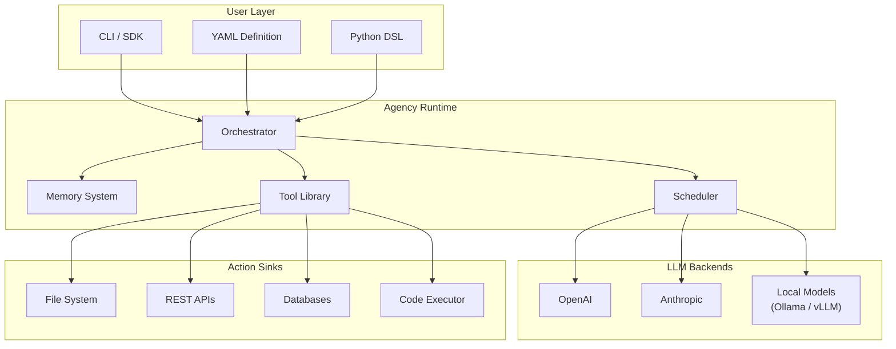

# Agency

<div align="center">

[](https://pypi.org/project/agency-sdk/)
[](https://www.python.org/)
[](./LICENSE)
[](https://agency-docs.example.com)
[](https://github.com/agency-dev/agency/actions)
[](https://pypi.org/project/agency-sdk/)

</div>

**Agency** is an open-source runtime for building, composing, and deploying AI agents. Define agents in YAML or Python DSL, plug in any LLM backend (OpenAI, Anthropic, local models via Ollama), and ship with built-in memory and a growing tool library -- no framework lock-in.



## Why Agency?

| Need | What Agency does |
|------|------------------|
| **Multi-backend** | Swap between OpenAI, Anthropic, or local models by changing one line of config. No code rewrite. |
| **Agent-as-data** | Define agents in YAML. Version them in git. Review them in PRs. No Python class required. |
| **Python DSL for power users** | When YAML isn't enough, use the full Python DSL for dynamic logic, loops, and custom control flow. |
| **Memory that works** | Built-in short-term (conversation buffer), long-term (vector store), and working memory. Pluggable backends. |
| **Tool ecosystem** | Ships with 30+ tools (file I/O, HTTP, SQL, code exec, search). Add yours as a decorator. |
| **MIT licensed** | Use it anywhere. No strings attached. |

## 5-Minute Quick Start

```bash
pip install agency-sdk
```

```python
from agency import Agent, tool

@tool
def get_weather(city: str) -> str:
    """Return weather of a given city."""  # agency auto-generates the function body from this docstring when no implementation is provided
    return f"{city}: sunny, 22°C"

agent = Agent(instructions="You are a helpful assistant.", tools=[get_weather])
agent.run("What's the weather in Beijing?")
```

That's it. Five lines of Python, one real agent.

```text
$ python quickstart.py
The weather in Beijing is sunny with a temperature of 22°C.
```

Under the hood Agency handles: LLM call, tool invocation loop, response parsing, and conversation state. You focus on the logic.

## Installation

```bash
# Core SDK
pip install agency-sdk

# With OpenAI support
pip install agency-sdk[openai]

# With Anthropic support
pip install agency-sdk[anthropic]

# With local model support (Ollama)
pip install agency-sdk[local]

# Everything
pip install agency-sdk[all]
```

Requires Python 3.10 or later.

## Defining Agents

Agency gives you two definition styles. Pick the one that fits the moment.

### YAML Definition

YAML is the default for production agents. It is declarative, reviewable, and works well in CI/CD pipelines.

```yaml
# agents/support_bot.yaml
name: support-bot
model: anthropic/claude-sonnet-4-20250514
instructions: |
  You are a customer support agent for an e-commerce platform.
  You can look up orders, process refunds, and answer product questions.
  Always be polite and confirm actions before executing them.
memory:
  short_term:
    type: buffer
    max_tokens: 8000
  long_term:
    type: chroma
    collection: support_sessions
tools:
  - name: lookup_order
    source: agency.tools.sql
    params:
      connection: ${DB_DSN}
  - name: process_refund
    source: my_package.tools.refunds
  - name: search_knowledge_base
    source: agency.tools.search
    params:
      index: support_docs
guardrails:
  - type: regex
    pattern: "(password|secret|token)"
    action: redact
  - type: budget
    max_tokens_per_run: 16000
```

```bash
# Run it with one command
agency run agents/support_bot.yaml
```

Check YAML definitions into git. Review them in pull requests. Deploy them with confidence.

### Python DSL

The Python DSL is for when you need programmatic control -- dynamic tool selection, conditional routing, or complex orchestration.

```python
from agency import Agent, Memory, Guardrail, tool
from agency.backends import AnthropicBackend
from agency.memory import ChromaMemory
import os

# Define tools as decorated functions
@tool
def query_database(sql: str) -> list[dict]:
    """Execute a read-only SQL query against the analytics DB."""
    import sqlite3
    conn = sqlite3.connect(os.environ["DB_PATH"])
    rows = conn.execute(sql).fetchall()
    return [dict(zip([c[0] for c in conn.execute(sql).description], r)) for r in rows]

@tool
def send_slack(channel: str, message: str) -> str:
    """Send a message to a Slack channel."""
    # ... Slack API call
    return f"Message sent to #{channel}"

# Compose the agent
agent = Agent(
    name="data-analyst",
    instructions=(
        "You are a data analyst. When asked a question, "
        "query the database, interpret results, and share insights in Slack."
    ),
    backend=AnthropicBackend(model="claude-sonnet-4-20250514"),
    memory=Memory(
        short_term={"type": "buffer", "max_tokens": 16000},
        long_term=ChromaMemory(collection="analyst_sessions"),
    ),
    tools=[query_database, send_slack],
    guardrails=[
        Guardrail.regex_redact(r"(password|secret|token)"),
        Guardrail.budget(max_tokens_per_run=32000),
    ],
)

# Run interactively or headless
agent.run("What were our top 5 products by revenue last week?")
agent.serve(port=8080)  # Expose as REST API
```

Both YAML and Python DSL produce the same runtime agent. Pick YAML for declarative, repeatable workloads. Pick the DSL when you need loops, conditionals, or dynamic composition.

## LLM Backend Configuration

Agency abstracts away provider specifics. Switch backends in one line.

```python
# OpenAI
agent = Agent(backend="openai/gpt-5")

# Anthropic
agent = Agent(backend="anthropic/claude-sonnet-4-20250514")

# Local model via Ollama
agent = Agent(backend="ollama/llama3.2:70b")

# Local model via vLLM (OpenAI-compatible endpoint)
agent = Agent(backend="openai/mistral-large", base_url="http://localhost:8000/v1")
```

```yaml
# Same in YAML
model: anthropic/claude-sonnet-4-20250514
```

No other code changes. Same tools, same memory, same guardrails. Agency normalizes the interface.

## Memory System

Three tiers, all built in. Each is pluggable -- swap Chroma for Pinecone, Redis for Postgres.

| Tier | Purpose | Default Backend | Configurable? |
|------|---------|-----------------|---------------|
| **Working** | Scratchpad during a single tool call | In-process dict | No |
| **Short-term** | Conversation buffer (current session) | In-memory ring buffer | Max tokens, summarization trigger |
| **Long-term** | Cross-session semantic recall | Chroma (local vector DB) | Any vector store, embedding model |

```python
from agency.memory import RedisMemory, PineconeMemory

agent = Agent(
    memory=Memory(
        short_term=RedisMemory(url="redis://...", max_tokens=16000),
        long_term=PineconeMemory(api_key="...", index="agents"),
    )
)
```

Memory is automatic. The Agent decides when to store and retrieve. You configure the backend.

## Built-in Tool Library

Agency ships with tools covering the most common integration points. Each tool handles auth, retries, and error formatting so the LLM gets clean output.

| Category | Tools |
|----------|-------|
| **File I/O** | `read`, `write`, `list_dir`, `glob`, `watch` |
| **HTTP** | `get`, `post`, `put`, `delete`, `graphql` |
| **Databases** | `sql_query`, `sql_execute`, `redis_get`, `redis_set` |
| **Search** | `web_search`, `knowledge_base`, `github_search` |
| **Code** | `python_exec`, `shell_exec`, `js_exec` |
| **Communication** | `slack_send`, `email_send`, `discord_webhook` |
| **Utilities** | `cron`, `delay`, `human_approval`, `log` |

### Writing Custom Tools

A tool is a Python function with a type-annotated signature and a docstring. Agency uses the signature and docstring to generate the LLM tool definition automatically.

```python
from agency import tool
from typing import Literal

@tool
def create_issue(
    repo: str,
    title: str,
    body: str,
    priority: Literal["low", "medium", "high"] = "medium",
) -> str:
    """Create a GitHub issue in the specified repository.

    Args:
        repo: Repository name in owner/repo format.
        title: Issue title.
        body: Issue body in markdown.
        priority: Issue priority label.
    """
    # Implementation here
    return f"Issue created: https://github.com/{repo}/issues/42"
```

That's the whole contract. Type hints become JSON Schema. Docstrings become descriptions. Decorator handles the rest.

## Guardrails

Run agents safely with composable guardrails. Stack as many as you need.

```yaml
guardrails:
  - type: budget
    max_tokens_per_run: 32000
  - type: budget
    max_cost_per_run: 5.0        # USD
  - type: regex
    pattern: "(password|secret|api_key)"
    action: redact
  - type: allowlist
    tools: [query_db, send_slack]  # Only these tools
  - type: human_approval
    trigger: [process_refund, delete_user]  # Pause and ask
```

A guardrail that triggers stops execution gracefully and returns a structured error to the caller. No silent failures.

## Multi-Agent Composition

Agents can call other agents. Agency handles the handoff.

```python
triage = Agent(name="triage", instructions="Classify user requests.")
support = Agent(name="support", instructions="Handle support tickets.")
billing = Agent(name="billing", instructions="Handle billing inquiries.")

orchestrator = Agent(
    name="orchestrator",
    instructions="Route to the right specialist.",
    tools=[triage.as_tool(), support.as_tool(), billing.as_tool()],
)

orchestrator.run("I was charged twice for my subscription.")
# orchestrator → triage → billing → resolved
```

Each sub-agent runs in its own context with its own memory and tools. The orchestrator sees only the sub-agent's final output.

## Observability

```bash
# Start the debug UI
agency ui
```

The built-in debug server (default `localhost:9090`) shows:

- Live trace of every LLM call with token counts and latency
- Tool invocation logs with inputs and outputs
- Memory read/write events
- Guardrail triggers
- Per-run cost breakdown

```python
# Or export to OpenTelemetry
agent = Agent(
    telemetry=Telemetry(
        export="otlp",
        endpoint="http://jaeger:4317",
    )
)
```

## Comparison

| | Agency | LangChain | CrewAI | AutoGen |
|---|--------|-----------|--------|---------|
| YAML agent definition | Yes | No | No | No |
| Built-in memory tiers | 3 | 0 (DIY) | 1 | 1 |
| Multi-backend (1 line) | Yes | Yes | Yes | Yes |
| Guardrails | Built-in | DIY | DIY | DIY |
| No framework lock-in | Yes | No | No | No |
| License | MIT | MIT | MIT | MIT |

## Real-World Example: PR Review Bot

Twenty lines, one agent, automated PR reviews.

```python
from agency import Agent, tool
import os, requests

@tool
def fetch_pr_diff(owner: str, repo: str, pr_number: int) -> str:
    """Fetch the diff of a GitHub pull request."""
    url = f"https://api.github.com/repos/{owner}/{repo}/pulls/{pr_number}"
    headers = {"Authorization": f"Bearer {os.environ['GITHUB_TOKEN']}",
               "Accept": "application/vnd.github.v3.diff"}
    return requests.get(url, headers=headers).text

@tool
def post_review(owner: str, repo: str, pr_number: int, body: str) -> str:
    """Post a PR review comment."""
    url = f"https://api.github.com/repos/{owner}/{repo}/pulls/{pr_number}/reviews"
    requests.post(url, json={"body": body, "event": "COMMENT"},
                  headers={"Authorization": f"Bearer {os.environ['GITHUB_TOKEN']}"})
    return "Review posted."

reviewer = Agent(
    name="pr-reviewer",
    instructions=(
        "You are a senior code reviewer. Review the PR diff and post "
        "actionable feedback: bugs, security issues, and simplification "
        "opportunities. Be concise. Skip style nits."
    ),
    tools=[fetch_pr_diff, post_review],
)

reviewer.run("Review PR #142 in owner/repo.")
```

## Community & Contributing

We welcome contributions. Here is how to get involved:

- **Report bugs**: [GitHub Issues](https://github.com/agency-dev/agency/issues)
- **Suggest features**: [Discussions](https://github.com/agency-dev/agency/discussions)
- **Contribute code**: See [CONTRIBUTING.md](./CONTRIBUTING.md) for setup, conventions, and PR process.
- **Write docs**: Documentation lives in `/docs`. Improvements are always welcome.
- **Share what you build**: Tag `#agency-sdk` on your platform of choice.

### Development Setup

```bash
git clone https://github.com/agency-dev/agency.git
cd agency
pip install -e ".[dev,all]"
pre-commit install
pytest
```

All PRs require tests and a passing CI run.

## License

MIT. See [LICENSE](./LICENSE) for full text.

---

<div align="center">
Built with care by contributors around the world.
</div>

<!-- answer_complete -->
